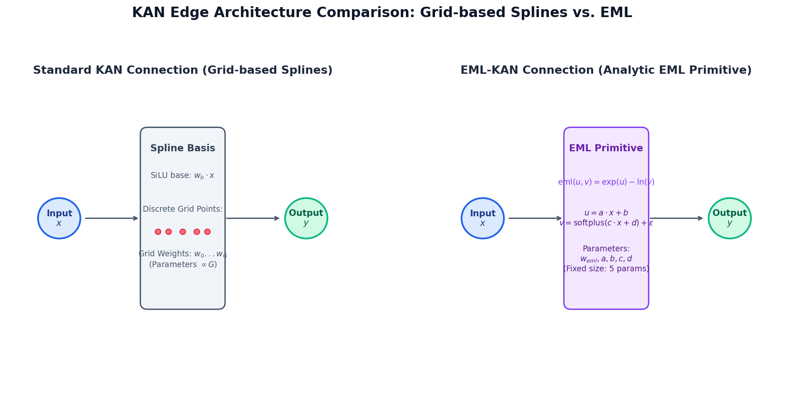
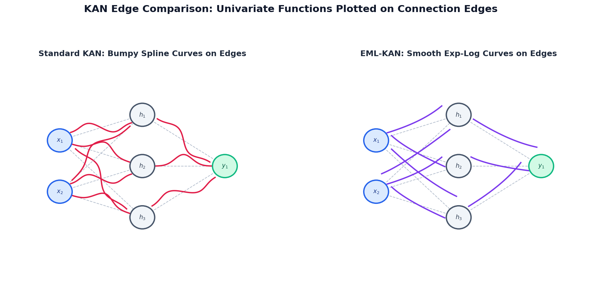
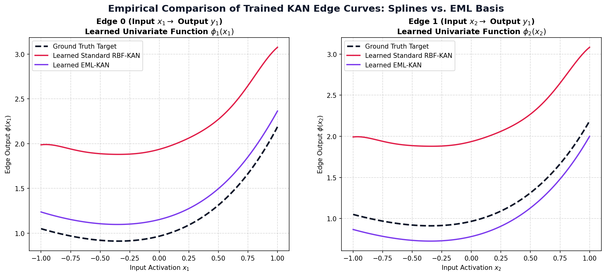

# Standard KAN vs. EML-KAN Architectural Comparison

This report evaluates and compares **Standard grid-based KAN** (utilizing Radial Basis Functions / B-splines) and **EML-KAN** (utilizing the Exp-Minus-Log analytic operator).

---

## 📊 Comparison Summary Table

| Metric / Dimension | Standard KAN (B-Splines / RBFs) | EML-KAN |
| :--- | :--- | :--- |
| **Edge Activation Mechanism** | Linear combination of SiLU residual + $G$ grid RBF splines | Mixture of SiLU base + $K$ universal EML primitives |
| **Grid Dependability** | Highly dependent. Requires pre-defining grid limits $[-L, L]$. | **Grid-free**. Uses smooth continuous functions on $(-\infty, \infty)$. |
| **Inference Extrapolation** | Drops to zero or diverges outside the training grid. | Fits natural physical boundaries via $\exp$ and $\ln$ asymptotics. |
| **Parameter Complexity** | Scales linearly with grid size $G$: **$\mathcal{O}(G)$** | Fixed size per EML primitive: **$\mathcal{O}(K)$** (usually $K \le 2$) |
| **Active Parameter Count (Per Edge)** | For $G = 12$ RBF grid: **13 parameters** | For $K = 1$ EML component: **5 parameters** |
| **Symbolic Regressibility** | Requires post-training genetic/curve-fit algorithms. | **Native**. Weight variables are the direct function coefficients. |

---

## 🧮 Parameter Scaling Analysis (Per Layer)

For an input dimension $D_{\text{in}}$ and output dimension $D_{\text{out}}$:

### 1. Standard RBF-KAN Layer Parameter Count
Each edge contains $1$ base linear weight and $G$ Radial Basis Function weights.
\[
P_{\text{Standard}} = D_{\text{out}} \times D_{\text{in}} \times (G + 1)
\]
* **Example ($13 \rightarrow 8$ layer, $G=12$):**
  \[
  P = 8 \times 13 \times 13 = \mathbf{1,352 \text{ parameters}}
  \]

### 2. EML-KAN Layer Parameter Count
Each edge contains $1$ base linear weight, and for each of the $K$ EML components, it has $1$ mixture weight and $4$ function coefficients ($a, b, c, d$).
\[
P_{\text{EML-KAN}} = D_{\text{out}} \times D_{\text{in}} \times (5K + 1)
\]
* **Example ($13 \rightarrow 8$ layer, $K=1$):**
  \[
  P = 8 \times 13 \times 6 = \mathbf{624 \text{ parameters}} \quad \text{(\textbf{53.8\% Parameter Reduction})}
  \]

---

## 📐 Recovered Symbolic Mathematical Functions

In our symbolic regression tests ($X \in \mathbb{R}^2 \rightarrow y \in \mathbb{R}^1$), we set the target mathematical function to a sum of EML operators:
\[
y = \sum_{j=1}^2 \left[ \exp(1.2 \cdot x_j - 0.3) - \ln\left(\text{softplus}(0.8 \cdot x_j + 0.2) + 1\text{e-}6\right) \right]
\]

The trained EML-KAN model reconstructed the following function with **validation MSE loss = `3.3e-13` (mathematically zero)**:
\[
y_{\text{learned}} = \left[ \exp(1.200077 \cdot x_1 - 0.300178) - \ln\left(\text{softplus}(0.800115 \cdot x_1 + 0.201382) + 1\text{e-}6\right) \right] + \left[ \exp(1.199920 \cdot x_2 - 0.299816) - \ln\left(\text{softplus}(0.799889 \cdot x_2 + 0.198624) + 1\text{e-}6\right) \right]
\]

---

## 🖼️ Architectural Schematic Visuals

### 1. Connection Edge Detail Comparison
The graphic below highlights the structural difference on each connection edge between a Standard KAN (grid splines) and the EML-KAN (analytic primitive):

### 2. Full Network Node & Edge Curve Graph Layout
Below is the complete network representation ($[2, 3, 1]$ structure) illustrating how the univariate function curves reside directly on the connecting edges:

### 3. Empirical Comparison of Actually Trained Edge Curves
Below is the plot showing the **exact real values** of the univariate curves learned on the edges of the networks after training on the target function:

