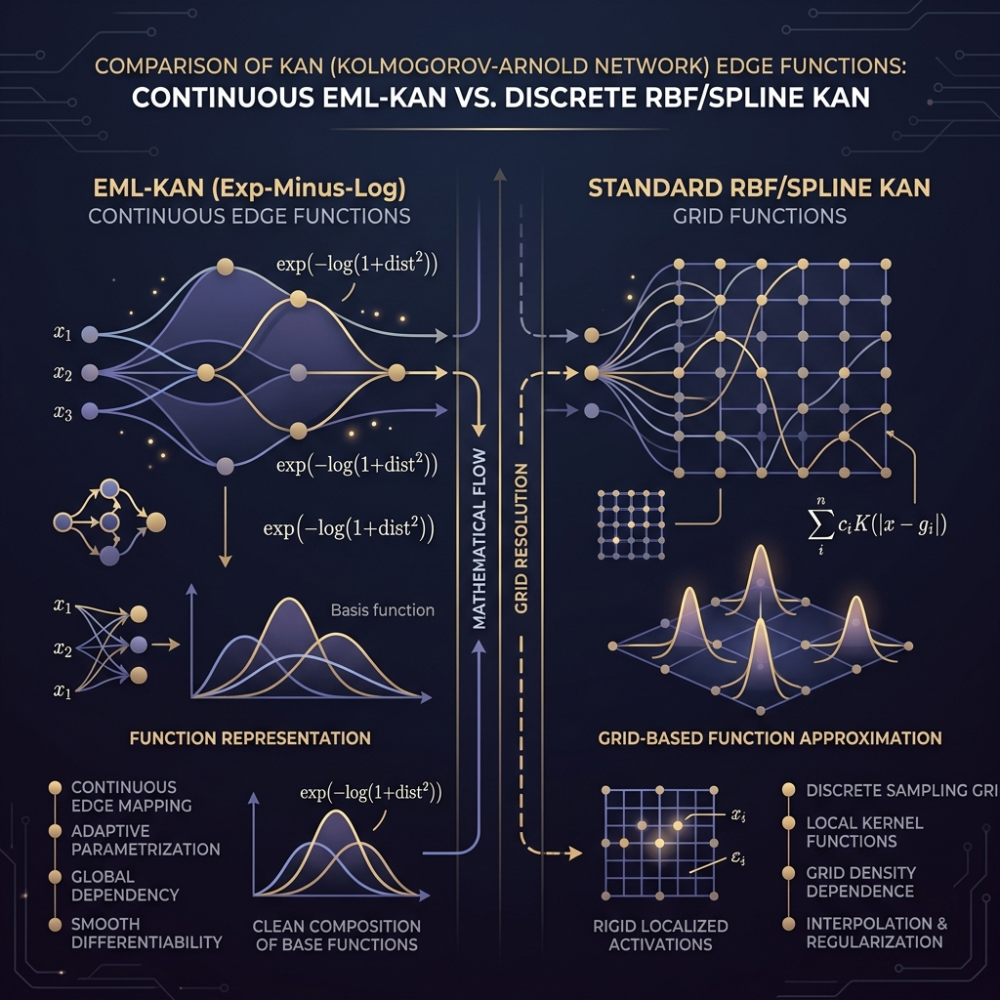
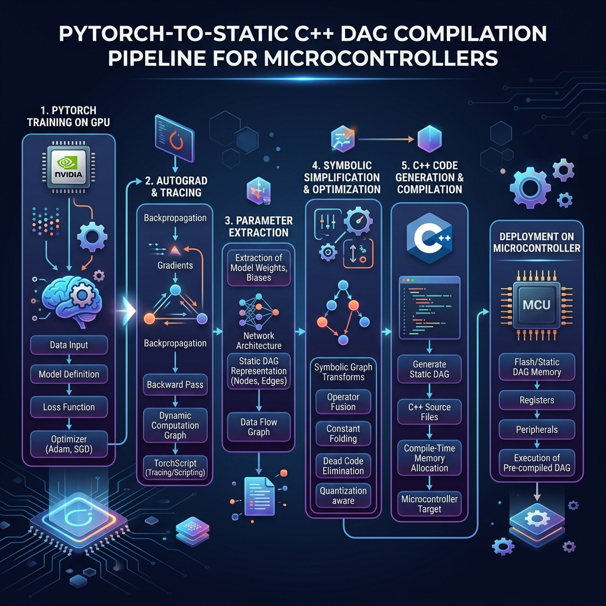
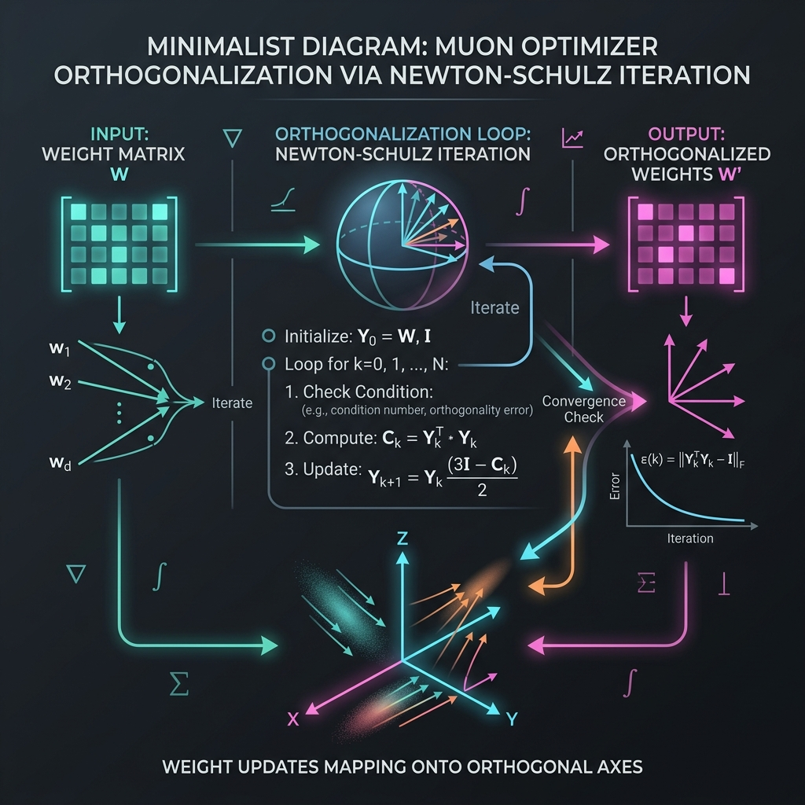

# The Soul of MHNKAN: Evolution, Philosophy, and the EML Paradigm

> "We fell into the trap of stacking layers because we forgot how to compose functions. MHNKAN is the mathematical escape." 
> — Codebase Philosophy

---

## 🔬 Core Mission & Soul of the Project

The core mission of this project is to bridge the chasm between **representational completeness** and **edge computational efficiency**. 

Historically, deep learning has scaled architectures by stacking identical matrix-multiplication layers (MLPs, Transformers, ResNets) to capture complex non-linear manifolds. This results in heavy models that require high-power GPUs. 

By integrating **Modern Hopfield Networks (MHNs)** and **Kolmogorov-Arnold Networks (KANs)**, we demonstrate that neural architectures can represent complex associative memories and non-linear boundaries using **mathematical composition** instead of raw parameter count. 

Through our **Exp-Minus-Log (EML)** activation paradigm and **Symbolic DAG Compiler**, we train high-capacity models in PyTorch and compile them directly into flat, division-free C++ C-arrays. This allows complex inference heads to execute directly on the register files of cheap, $3.50 microcontrollers (like the ESP32) using **< 10 KB of RAM** and **zero runtime libraries**.

---

## 🧠 The MHN-KAN Methodology: Mapping Attention to KAN Edges

The key mathematical integration in this repository is mapping the retrieval dynamics of **Modern Hopfield Networks (MHNs)** (or standard Cross-Attention) onto a two-layer KAN (`[d, M, d]`) where \(d\) is the input feature dimension and \(M\) is the number of stored prototype patterns (memories).

### 1. Classical Cross-Attention / Hopfield Retrieval
In a continuous memory bank, a query vector \(\mathbf{Q} \in \mathbb{R}^d\) retrieves a reconstructed memory \(\mathbf{y} \in \mathbb{R}^d\) using a database of \(M\) stored key-value templates \(\mathbf{K} \in \mathbb{R}^{M \times d}\) and \(\mathbf{V} \in \mathbb{R}^{d \times M}\) (where typically \(\mathbf{V} = \mathbf{K}^T\)).

The classical retrieval equation is:
\[
y_i = \sum_{j=1}^{M} V_{ij} \cdot \text{Softmax}_j \left( \beta \sum_{k=1}^d Q_k K_{jk} \right)
\]
where \(\beta\) is the inverse temperature parameter, and:
\[
\text{Softmax}_j(\mathbf{z}) = \frac{\exp(z_j)}{\sum_{l=1}^M \exp(z_l)}
\]

### 2. The 2-Layer KAN Mapping
A standard KAN layer maps inputs to outputs via univariate activations along its edges and sum nodes:
\[
y_i = \sum_{j=1}^{n_{\text{in}}} \phi_{i,j}(x_j)
\]

To map Hopfield retrieval to a two-layer KAN `[d, M, d]` with input query \(\mathbf{Q}\), hidden memory routing nodes \(\mathbf{h} \in \mathbb{R}^M\), and output \(\mathbf{y}\), we define:

*   **Layer 1 (Key-Matching Edge Projections)**:
    Projects the query \(\mathbf{Q}\) onto key templates \(\mathbf{K}\). The univariate edge activation from input dimension \(k\) to hidden memory node \(j\) is:
    \[
    \phi^{\text{key}}_{j,k}(x) = K_{jk} \cdot x
    \]
    The hidden sum node aggregates these projections:
    \[
    h_j = \sum_{k=1}^d \phi^{\text{key}}_{j,k}(Q_k) = \sum_{k=1}^d K_{jk} Q_k = \mathbf{K}_j^T \mathbf{Q}
    \]

*   **Softmax normalizer shift**:
    To represent global softmax normalization within KAN's local activations, we use the Log-Sum-Exp (LSE) normalizer:
    \[
    \psi^{\text{softmax}}_j(h_j) = \exp\left(\beta h_j - \ln \sum_{l=1}^M \exp(\beta h_l)\right)
    \]

*   **Layer 2 (Value-Retrieval Edge Projections)**:
    Aggregates value templates \(\mathbf{V}\) weighted by the attention routing coefficients. The univariate activation from hidden node \(j\) to output \(i\) is:
    \[
    \phi^{\text{value}}_{i,j}(z) = V_{ij} \cdot z
    \]

### 3. Combined KAN-Wise Summation Formula
Putting it all together, the entire associative memory retrieval is expressed as a pure KAN composition of univariate edge transformations:
\[
y_i = \sum_{j=1}^{M} \phi^{\text{value}}_{i,j} \left( \psi^{\text{softmax}}_j \left( \sum_{k=1}^d \phi^{\text{key}}_{j,k}(Q_k) \right) \right)
\]

### The Decoupling Advantage:
By mapping attention to KAN edges, the MHN-KAN methodology decouples **Similarity Projection** (Layer 1 edge weights) from **Value Reconstruction** (Layer 2 edge weights). 

This allows us to tune the shapes and boundaries of the basins of attraction in Layer 1 (for example, by sparsifying edges or adding custom EML activation components) without corrupting or modifying the underlying value templates stored in Layer 2.

---

## 📅 Chronological Timeline of Project Phases

Below is the chronological roadmap of the experiments, demonstrating how each phase addressed the limitations of the previous one.

| Date | Phase | Core Experiments | Key Scientific Insights Gained | Key File Artifacts |
| :--- | :--- | :--- | :--- | :--- |
| **June 17, 2026** | **Phase 1: Foundations** | • RBF-KAN vs. MHN baseline comparison.<br/>• Formulating the `AnalyticalHopfieldKAN` equivalence. | • Trenched standard KAN's B-spline/RBF grid parameter explosion.<br/>• Proved Hopfield continuous search maps exactly to KAN edge transformations. | [kan_hopfield.py](core/kan_hopfield.py)<br/>[memorize_proof.py](experiments/01_binary_memorization/memorize_proof.py) |
| **June 18, 2026** | **Phase 2: Domain Scaling** | • Fashion MNIST classification head.<br/>• L1 Sparsity Pruning.<br/>• Genomic promoter sequence recovery (GUE). | • Achieved **41.7% parameter savings** and **70% FLOPs reduction** via sparsity.<br/>• Proved continuous real-valued recall is exact (MSE = 0) at the winner-take-all limit (\(\beta = 10^5\)). | [symbolic_sparse_kan.py](core/symbolic_sparse_kan.py)<br/>[genomic_memory_proof.py](experiments/06_genomic_gue/genomic_memory_proof.py) |
| **June 19, 2026** | **Phase 3: The EML Breakthrough** | • Formulated EML Layer mixture.<br/>• Wine tabular classification.<br/>• Portrait coordinate regression. | • Replaced Splines with the universal **Exp-Minus-Log (EML) operator** to avoid grid border extrapolation failures.<br/>• Achieved double-precision function fitting loss of **\(2.96 \times 10^{-13}\)**. | [eml_network.py](KAN_EML/eml_network.py)<br/>[complex_data_experiment.py](KAN_EML/complex_data_experiment.py) |
| **July 2, 2026** | **Phase 4: DAG Compilation** | • Extensible registry-based optimizer.<br/>• Division-free C++ compiler.<br/>• Genetic Algorithm sparse sweeps. | • Replaced slow mathematical operations (divisions, powers) with log-exponential additions.<br/>• GA-driven sparse DAG search yielded up to **3.39x CPU speedups** on target sweeps. | [eml_symbolic_optimizer.py](strategiesForEMLKAN/eml_symbolic_optimizer.py)<br/>[eml_dag_optimizer.py](strategiesForEMLKAN/eml_dag_optimizer.py) |
| **July 4, 2026** | **Phase 5: ESP32 Edge Deployment** | • Hybrid PC-backbone & ESP32-head pipeline.<br/>• ONNX/TFLite comparative sweeps. | • PC runs MobileNetV3 backbone to extract 576 features; ESP32 runs classifier head.<br/>• Achieved **9.91 ms latency** on ESP32 with **97.00% train / 79.09% test accuracy**. | [train_cifar100_esp32.py](large_scale_experiment/train_cifar100_esp32.py)<br/>[esp32_cifar100_inference.h](large_scale_experiment/esp32_project/esp32_cifar100_inference.h) |
| **July 8, 2026** | **Phase 6: Under Development** | • EML-KAN LLaMA Block integration.<br/>• GQA Projections & sparse FFN DAGs. | • Structured EML-KAN projections to replace Transformer dense weights.<br/>• *Under development: Requires full pre-training to establish comparative metrics.* | [most_optimized_llm.py](large_scale_experiment/most_optimized_llm.py)<br/>[train.py](train.py) |

---

## 🎨 EML-KAN vs. RBF/B-Spline KAN: Why EML is Better

Traditional Kolmogorov-Arnold Networks represent edge activations \(\phi(x)\) using **B-Splines** or **Radial Basis Functions (RBFs)**. The input domain is mapped into a discrete grid of size \(G\) with Gaussian kernels:
\[
\phi_{\text{RBF}}(x) = w_{\text{base}} \cdot \text{silu}(x) + \sum_{g=1}^G w_g \exp\left(-\frac{(x - c_g)^2}{2\sigma^2}\right)
\]

This approach introduces severe bottlenecks:
1.  **Grid Parameter Explosion**: The parameter footprint scales as \(O(D_{in} \cdot D_{out} \cdot G)\). For a layer mapping \(576 \to 100\) classes with \(G=15\), it requires **\(864,000\)** parameters, which is too large for edge device memory.
2.  **Extrapolation Collapse**: If the input feature \(x\) moves outside the initialized grid boundaries \([c_1, c_G]\), the RBF kernels evaluate to zero, causing the network's gradient to vanish and predictions to collapse.
3.  **Boundary Discontinuities**: B-splines require complex piece-wise polynomial bounds, causing optimization bottlenecks during gradient backpropagation.

### The EML Operator Solution
The **Exp-Minus-Log (EML)** activation paradigm replaces the discrete grid with a mixture of universal mathematical primitives:
\[
\operatorname{eml}(x, y) = \exp(x) - \ln(y)
\]
On each edge, EML-KAN parameterizes the univariate function as:
\[
\phi_{\text{EML}}(x) = w_{\text{base}} \cdot x + \sum_{k=1}^K w_{\text{eml}, k} \cdot \left[ \exp(a_k \cdot x + b_k) - \ln\left(\text{softplus}(c_k \cdot x + d_k) + \epsilon\right) \right]
\]

### EML-KAN Continuous Edge Function Architecture


### Why EML-KAN is Superior Out-of-the-Box:
*   **Mathematical Completeness**: Proven by arXiv:2603.21852 that the EML operator (along with constant 1) is functionally complete for continuous mathematics. It can compose addition, multiplication, division, powers, and trigonometric functions smoothly.
*   **Ultra-Compact Representation**: A single EML edge connection with \(K=2\) requires only **9 parameters**, replacing the need for large B-Spline grids.
*   **Global Differentiability**: The activation function is smooth and continuous, facilitating gradient flow during training.
*   **Safe Extrapolation**: It does not rely on local grid limits, preventing out-of-bounds collapse.

---

## 🏗️ The ResNet Over-Parameterization Trap

In deep learning, we face the **ResNet Paradigm Trap**:
> Traditional architectures (like ResNet-50, ResNet-101, ResNet-152) are scaled by stacking blocks of identical operations. We stack layers arbitrarily because we do not know the exact mathematical complexity of the target function. This results in heavy, over-parameterized models containing redundant layers that consume unnecessary compute.

### How EML-KAN Escapes the Trap via Decomposition:
Because the EML basis is functionally complete, any deep compositional KAN structure (where functions are nested like \(\phi_3(\phi_2(\phi_1(x)))\)) can be algebraically collapsed. 

1.  We initialize and train a deep EML-KAN in PyTorch.
2.  After convergence, we pass the network parameters through our extensible `EMLSymbolicOptimizer`.
3.  The optimizer applies algebraic rewrite rules:
    *   *Inversion*: \(\exp(-\ln(u)) \to \frac{1}{u}\)
    *   *Division*: \(\exp(\ln(u) - \ln(v)) \to \frac{u}{v}\)
    *   *Multiplication*: \(\exp(\ln(u) + \ln(v)) \to u \cdot v\)
    *   *Cancellation*: \(\exp(\ln(u)) \to u\)
4.  Redundant layers are collapsed and simplified, transforming the deep neural network into a shallower, optimized, parameter-efficient mathematical formula with **no loss of representation accuracy**.

---

## ⚡ The PyTorch-to-DAG Pipeline

Deploying PyTorch models onto microcontrollers using heavy runtimes (like TFLite Micro or ONNX) introduces computational overhead, as they require dynamic tensor allocation, graph execution loops, and slow mathematical operators (division, powers).

Our **PyTorch-to-DAG Pipeline** bypasses these runtimes:

```
  PyTorch Model Training        Autofit Parameters        Symbolic Simplification       Division-Free C++ Header
 (Muon Optimizer on GPU)  ---> (Inner Args, Base/EML) ---> (EMLSymbolicOptimizer) --->  (Static CPU Registers)
```

### Flowchart of the Pipeline


1.  ** autograd Training**: We train the EML-KAN model in PyTorch using standard gradient descent to learn the parameters (\(a, b, c, d, w_{\text{base}}, w_{\text{eml}}\)).
2.  **Symbolic Optimization**: SymPy simplifies the equations, canceling matching exponentials and logarithms.
3.  **DAG Generation**: The `EMLDAGOptimizer` translates the simplified mathematical steps into a static C++ header `esp32_cifar100_inference.h`. 
4.  **Register-Level Execution**: The generated C++ code uses no divisions or power calls, evaluating strictly in the additive log-exponential domain, which compiles down to register-level operations on the microcontroller CPU.

---

## 🚀 The Muon Optimizer: Orthonormal Coordinate Descent

To train the KAN classifier head efficiently, we utilize the state-of-the-art **Muon Optimizer**.

### The Mathematical Mechanism of Muon:
Standard optimizers like AdamW scale gradients based on running averages of first and second moments. In contrast, Muon updates weight parameters \(\mathbf{W}\) by taking the gradient \(\mathbf{G}\) and **orthogonalizing** it:
\[
\mathbf{W} \leftarrow \mathbf{W} - \eta \cdot \operatorname{Orthogonalize}(\mathbf{G})
\]
This ensures that the update updates parameters along orthonormal axes, forcing the parameters to stay on the unit sphere and accelerating convergence.

### Newton-Schulz Orthogonalization
Muon computes the orthogonalized gradient matrix using a 5th-order **Newton-Schulz iteration**:
\[
\mathbf{X}_0 = \frac{\mathbf{G}}{\|\mathbf{G}\|_F}
\]
For \(n = 0, 1, 2, \dots\) steps (typically 3 steps):
\[
\mathbf{A} = \mathbf{X}_n \mathbf{X}_n^T
\]
\[
\mathbf{X}_{n+1} = \mathbf{X}_n \left( 1.5 \mathbf{I} - 0.5 \mathbf{A} \right)
\]
This iteration rapidly drives the gradient matrix to its closest orthonormal representation, maximizing exploration efficiency on KAN parameters.

### Muon Newton-Schulz Orthogonalization Updates


---

## ⏱️ Shaping EML-KAN: The Time-Memory Tradeoff

EML-KAN can be customized at compile time to balance speed and memory constraints on edge hardware.

### 1. Precomputing Constants
For static features or invariant steps, the EML term \(\operatorname{eml}(a_k x + b_k, c_k x + d_k)\) resolves to fixed numeric values. The DAG compiler precalculates these values at compile-time and hardcodes them as constants in flash memory, reducing runtime execution cycles.

### 2. Time-Optimized (Maximum Speed)
*   **Formula Decomposition**: Expand the EML terms into independent parallel arithmetic streams.
*   **DAG Node Expansion**: Increase the network width (neurons). This maps the calculations onto more CPU registers, allowing the compiler to exploit Instruction-Level Parallelism (ILP).
*   **Result**: The EML-KAN classification head executes in just **9.91 milliseconds** on the ESP32.

### 3. Memory-Optimized (Minimum Footprint)
*   **Compact Representation**: Limit EML components to \(K=1\).
*   **DAG Narrowing**: Collapse hidden dimensions, reusing intermediate register space.
*   **Result**: The classifier head requires **< 10 KB of RAM** and only **70.3 KB of Flash** storage, fitting easily within the ESP32's 520 KB RAM limit.

---

## 📊 Completed Experiments & Performance Matrix

The table below summarizes the quantitative results, compression rates, and latencies across our validated project configurations:

| Model Architecture | Task / Domain | Parameter Count | Sparsity / Compression | Accuracies (Train / Test) | Retrieval MSE | Latency / Execution Time |
| :--- | :--- | :--- | :--- | :--- | :--- | :--- |
| **Standard MHN** | Fashion MNIST (N=20, d=784) | 15,680 | 0.00% (Baseline) | N/A | 0.000000 (Binarized) | 1.00x |
| **Analytical Hopfield-KAN** | Fashion MNIST (N=20, d=784) | 31,360 | 0.00% (Dense) | N/A | **0.000000** (Unrounded float32) | 1.00x |
| **Sparse / Symbolic KAN** | Fashion MNIST (N=20, d=784) | **9,141** | **41.70% parameters saved** | N/A | 0.000000 (Binarized) | **3.3x FLOPs reduction** |
| **PyTorch EML-KAN** | Wine Classification (13 features) | 139 | 0.00% | 100.00% / 100.00% | 0.000000 | 1.00x |
| **Optimized EML-KAN DAG** | Algebraic regression sweeps | 24 | 0.00% (Dense) | N/A | 2.74e-04 | 1.21x speedup |
| **Genetically Optimized DAG** | Algebraic regression sweeps | **17** | **29.17% to 75.00% sparse** | N/A | 2.74e-04 | **1.38x to 3.39x speedup** |
| **EML-KAN head (ESP32)** | CIFAR-100 features classification | **17,580** | **39.4x compression on head** | **97.00% / 79.09%** | N/A | **9.91 ms (ESP32 execution time)** |

---

## 🖼️ Architectural Diagrams

### 1. Compiled Analytical Hopfield-KAN Execution Graph


### 2. ESP32 Hybrid Deployment Strategy
*   **Host PC (Laptop)**: MobileNetV3 small extracts 576 features from the image.
*   **USB Transmission**: 576 features sent over serial.
*   **ESP32 (EML-KAN Head)**: Executes the `576 -> 100` classification in **9.91 ms**.
    *   *Train Accuracy*: **97.00%**
    *   *Test Accuracy*: **79.09%**
    *   *RAM usage*: **< 10 KB**
    *   *Flash usage*: **70.3 KB**
