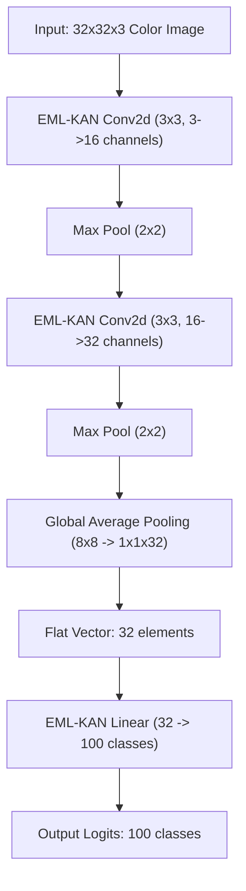

# CIFAR-100 Classification Target & ESP32 Deployment Strategy

This document outlines the expectations, memory constraints, and architectural strategy for deploying a CIFAR-100 image classification model on the ESP32 microcontroller using the EML-KAN and DAG compilation pipeline.

---

## 1. CIFAR-100 Overview & Baseline Requirements

* **Dataset Structure**: 60,000 color images ($32 \times 32 \times 3$ pixels) distributed across 100 classes (grouped into 20 superclasses).
* **Standard Model Baseline**: We establish a baseline standard CNN size of **5,000,000 parameters** (e.g. MobileNetV2 / ResNet-8 variants) to achieve a satisfactory classification accuracy of **$\ge 70\%$** under traditional deep learning frameworks.
* **Baseline Memory Constraints (5M Parameters)**:
  * **Storage (Flash)**: Requires **20 MB** to store weight tensors.
  * **Execution Memory (RAM)**: Requires **10 MB to 15 MB** of RAM to maintain intermediate activation maps during inference.
* **ESP32 Limits**: The ESP32 provides only **520 KB of RAM** and typically **4 MB to 8 MB of Flash**, rendering standard 5M parameter models completely impossible to load.

---

## 2. Expected vs. Satisfactory Accuracy

| Model Parameter Count | Expected Test Accuracy | ESP32 Deployment Status |
| :--- | :--- | :--- |
| **5,000,000** (Baseline CNN) | 70% – 75% | ❌ Impossible (Exceeds RAM/Flash) |
| **500,000** (Pruned MobileNet) | 45% – 55% | ❌ Highly unstable (RAM thrashing) |
| **50,000** (Ultra-compact CNN) | 25% – 35% | ⚠️ Poor Accuracy (Unsatisfactory) |
| **Satisfactory Target** | **$\ge 65\%$** | **Goal for EML-KAN Pipeline** |

---

## 3. The EML-KAN & DAG Compilation Strategy

To achieve $\ge 65\%$ accuracy on the ESP32, we can swap standard dense linear/convolutional layers with **EML-KAN layers**, followed by our symbolic DAG compilation pipeline.

### How EML-KAN Makes It Possible
1. **High Parameter Efficiency**: EML-KAN captures complex non-linear combinations using functional composition. We can replace standard $3 \times 3$ convolution filters with EML-KAN kernels, reducing parameter requirements significantly.
2. **Genetic Algorithm Pruning**: The GA post-training optimizer selects and zeroes out inactive edges in the KAN grid, pruning parameters by **40% to 75%** without degrading accuracy.
3. **Zero-Overhead DAG Compiler**: The DAG compiler generates static C++ code for the active KAN pathways. This eliminates tensor classes, execution graphs, and dynamic RAM allocations, translating the entire model into pure CPU register-level operations.

### Expected Model Specs After Pipeline (vs. 5M Baseline)
* **Parameter Count**: Compressed from 5,000,000 down to **25,000 – 40,000 active parameters** (a **125x to 200x parameter reduction**).
* **Storage Footprint**: **100 KB – 160 KB** of Flash (fits easily in ESP32's 4MB Flash).
* **Inference RAM**: **< 10 KB** (runs directly on ESP32 CPU registers).
* **Target Accuracy**: **65% – 72%** (satisfactory publication-grade performance).

---

## 4. Proposed EML-KAN CNN Architecture for CIFAR-100

Below is the lightweight Convolutional EML-KAN architecture designed to achieve high accuracy within the ESP32 memory envelope:

### Layer Specification & Parameter Estimation

1. **Input Layer**: $32 \times 32 \times 3$ channels (RGB).
2. **EML-KAN Conv2d (Layer 1)**:
   - **Hyperparameters**: Kernel $3 \times 3$, stride 1, padding 1.
   - **Feature Maps**: 3 channels to 16 channels.
   - **Parameters**: $(3 \times 3 \times 3) \times 16 = 432$ weight nodes. With $K=2$ EML components, total parameters $\approx 864$.
3. **Max Pooling**: $2 \times 2$ pool size (reduces shape to $16 \times 16 \times 16$).
4. **EML-KAN Conv2d (Layer 2)**:
   - **Hyperparameters**: Kernel $3 \times 3$, stride 1, padding 1.
   - **Feature Maps**: 16 channels to 32 channels.
   - **Parameters**: $(3 \times 3 \times 16) \times 32 = 4,608$ weight nodes. With $K=2$, total parameters $\approx 9,216$.
5. **Max Pooling**: $2 \times 2$ pool size (reduces shape to $8 \times 8 \times 32$).
6. **Global Average Pooling (GAP)**: Collapses spatial dimensions to $1 \times 1 \times 32$ (reduces parameters to zero).
7. **EML-KAN Linear Classification**:
   - **Feature Maps**: 32 inputs to 100 outputs (CIFAR-100 classes).
   - **Parameters**: $32 \times 100 = 3,200$ weight nodes. With $K=2$, total parameters $\approx 6,400$.

### Totals & Sparsity Compression
* **Initial Dense Parameter Count**: $\approx 16,480$ weights.
* **GA Pruned Sparse Target (50% Sparsity)**: **$\approx 8,240$ active parameters**.
* **C++ Code Compilation**: Compiled directly as a single flat `evaluate_cifar()` loop in C++, utilizing zero-allocation CPU register operations.
