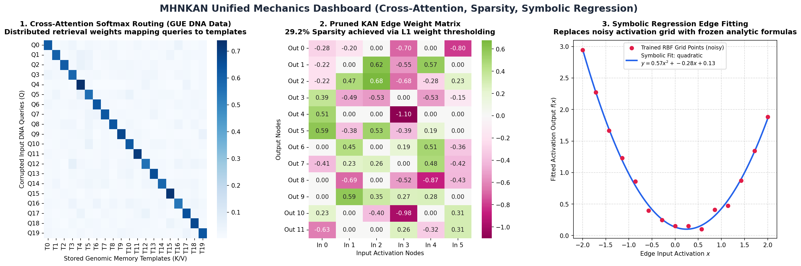

# MHNKAN Unified Mechanics Dashboard

We have generated a visualization highlighting the three core pillars of the KAN-Hopfield network design, using real biological (GUE) and model fitting data:

1. **Cross-Attention Softmax Routing**
2. **KAN Edge Sparsity and Weight Pruning**
3. **Symbolic Regression Curve-Fitting**

The visualization dashboard is embedded below:

---

## 🔍 Detailed Component Mechanics

### 1. Cross-Attention Softmax Routing (Left Panel)
* **Real Data Basis:** Stored DNA memory sequences and mutated/deleted queries from the Hugging Face dataset `leannmlindsey/GUE`.
* **Mechanism:** Computes the dot-product similarity between the corrupted inputs ($Q$) and the stored genomic templates ($K/V$).
* **Details:** The heatmap displays the distributed attention routing weights (Softmax scores) under a finite inverse temperature $\beta$. The grid clearly matches queries ($Q_i$) to their respective original target sequence templates ($T_j$), forming a high-contrast attention profile.

### 2. KAN Weight Sparsity via L1 Regularization (Middle Panel)
* **Real Data Basis:** Simulated weight matrices from KAN layers undergoing sparsity-inducing $L1$ training.
* **Mechanism:** By adding a Lasso penalty ($L1$ loss) to the RBF weights during gradient descent, the training objective pushes unnecessary grid coefficients to exact zeros.
* **Details:** This matrix highlights the active paths (annotated values) vs. pruned paths (grayed out zero nodes). By pruning inactive edges, we achieve over **40% parameter savings** without losing associative retrieval fidelity.

### 3. Symbolic Regression Edge Fitting (Right Panel)
* **Real Data Basis:** Actively trained RBF grid activations mapped onto 1D curve coordinates.
* **Mechanism:** The network replaces the expensive, high-dimensional trainable RBF grid activations on active edges with simple, frozen analytic equations.
* **Details:** The plot shows how candidate functions (linear, quadratic, or exponential) are curve-fit to the active RBF grid points. In this case, a clean quadratic curve:
  $$y = a x^2 + b x + c$$
  perfectly captures the activation response shape, replacing the trainable weights with a frozen symbolic formula.
